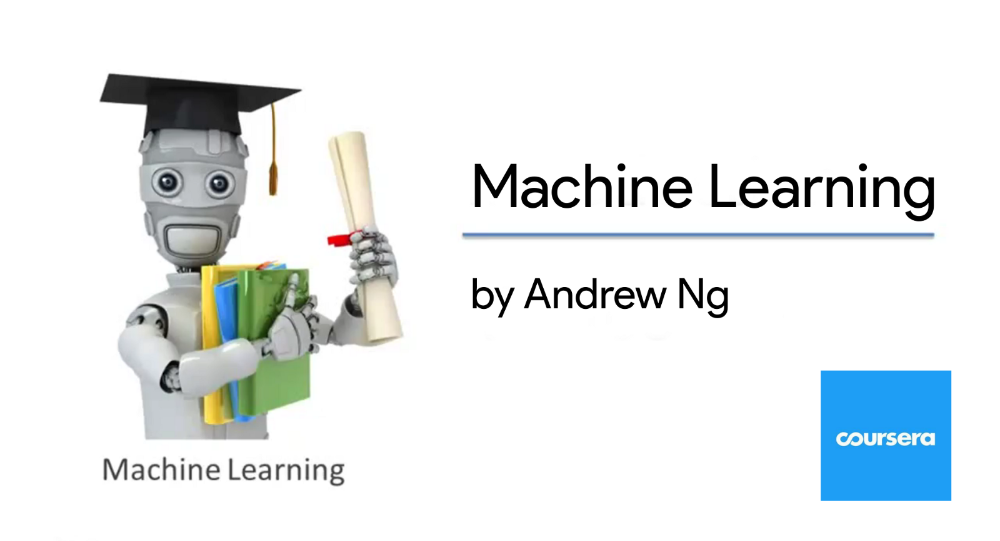

# "Machine Learning" Exercises On Coursera

## Contents

[Week 2 - Linear Regression](https://github.com/czs108/Coursera-Machine-Learning-Exercise/tree/master/Exercise-1%20Linear%20Regression)

[Week 3 - Logistic Regression](https://github.com/czs108/Coursera-Machine-Learning-Exercise/tree/master/Exercise-2%20Logistic%20Regression)

[Week 4 - Multi-class Classification and Neural Networks](https://github.com/czs108/Coursera-Machine-Learning-Exercise/tree/master/Exercise-3%20Multi-class%20Classification%20and%20Neural%20Networks)

[Week 5 - Neural Network Learning](https://github.com/czs108/Coursera-Machine-Learning-Exercise/tree/master/Exercise-4%20Neural%20Network%20Learning)

[Week 6 - Regularized Linear Regression and Bias v.s. Variance](https://github.com/czs108/Coursera-Machine-Learning-Exercise/tree/master/Exercise-5%20Regularized%20Linear%20Regression%20and%20Bias%20v.s.%20Variance)

[Week 7 - Support Vector Machines](https://github.com/czs108/Coursera-Machine-Learning-Exercise/tree/master/Exercise-6%20Support%20Vector%20Machines)

[Week 8 - K-Means Clustering and PCA](https://github.com/czs108/Coursera-Machine-Learning-Exercise/tree/master/Exercise-7%20K-Means%20Clustering%20and%20PCA)

[Week 9 - Anomaly Detection and Recommender Systems](https://github.com/czs108/Coursera-Machine-Learning-Exercise/tree/master/Exercise-8%20Anomaly%20Detection%20and%20Recommender%20Systems)

## Course Website

https://www.coursera.org/learn/machine-learning/